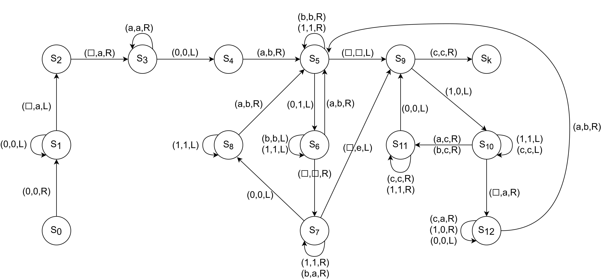

# Turing machine for checking whether a number is prime

## Algorithm steps

1. Check that the given number (later called brave) is different from one (because one is divisible by itself but not prime).
2. Before given number create a number two (consisting of the letters a), which is our first divisor.
3. Subtract the divisor from the brave (replace each "a" with "b" and replace each "0" with "1").
    - End algorithm if found "e"
4. Check that the brave divides by the divisor (all "0"s have been replaced by "1"s).
    - If not, reset the divisor (replace "b" with "a") and return to step 3.
    - If the number is divisible then add "e" after the brave (which will terminate the algorithm in step 5 if brave is equal to divisor)
5. Check if the brave is equal to the divisor ("1" is replaced by "0", "a" and "b" are replaced by "c").
    - If no, reset the brave (swap "1" for "0"), reset the divisor" (swap "b" for "a"), add one "a" to divisor and go back to step 3
    - If yes, end algorithm as brave is prime

## Graph

## Examples

### Legend
- [] - empty cell
- (S0) - initial state
- (SX) - intermediate state
- (Sk) - end state

### Prime number 3

(algorithm step - description - temporary description)

1. (1) - Number is not equal one - [][][][]0(S1)00[]
2. (2) - Create number two - [][]a(S4)a000[]
3. (3) - Subtract 2 from 3 - \[]bb110[]
4. (4) - 3 minus 2 greater than 0 - [][]aa11(S7)0[]
5. (3) - Subtract 2 from 1 - [][]bb111(S5)[]
6. (4) - 1 minus 2 less or equal 0 - [][]bb11(S9)1[]
7. (5) - 3 in not equal 2 - [][]cc(S11)100[]
8. (5) - Add 1 to 2 - []aa(S12)a000[]
9. (3) - Subtract 3 from 3 - (S6)[]bbb111[]
10. (4) - 3 is divisible by 3 - []aaa111(S7)[]
11. (5) - 3 is equal 3 - []ccc(S11)000e

Algorithm ends with: []ccc(Sk)000e

### Non prime number 4

(algorithm step - description - tape)

1. (1) - Number is not equal one - [][][][][]0(S1)000[]
2. (2) - Create number two - [][][]a(S4)a0000[]
3. (3) - Subtract 2 from 4 - [][][]bb(S6)1100[]
4. (4) - 4 minus 2 greater than 0 - [][][]aa11(S7)00[]
5. (3) - Subtract 2 from 2 less or equal 0 - [][][]bb11(S6)11[]
6. (4) - 4 is divisible by 2 - [][][]aa1111(S7)[]
7. (5) - 4 is not equal 2 - []\[]cc1000e
8. (5) - Add 1 to 2 - [][]aa(S12)a0000e
9. (3) - Subtract 3 from 4 - \[]bbb1110e
10. (4) - 4 minus 3 greater than 0 - [][]aaa111(S7)0e
11. (3) - While subtracting 3 from 1 found e - [][]abb111(S5)1e

Latest tape state: [][]abb1111(S5)e
Move (S5,e) -> (1,X,X) not allowed
